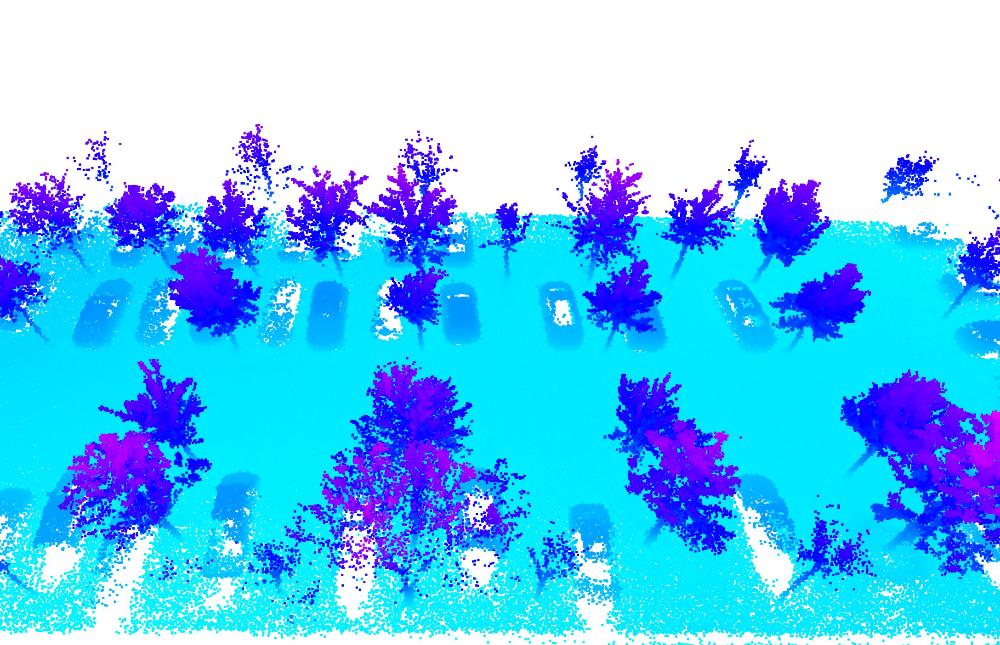
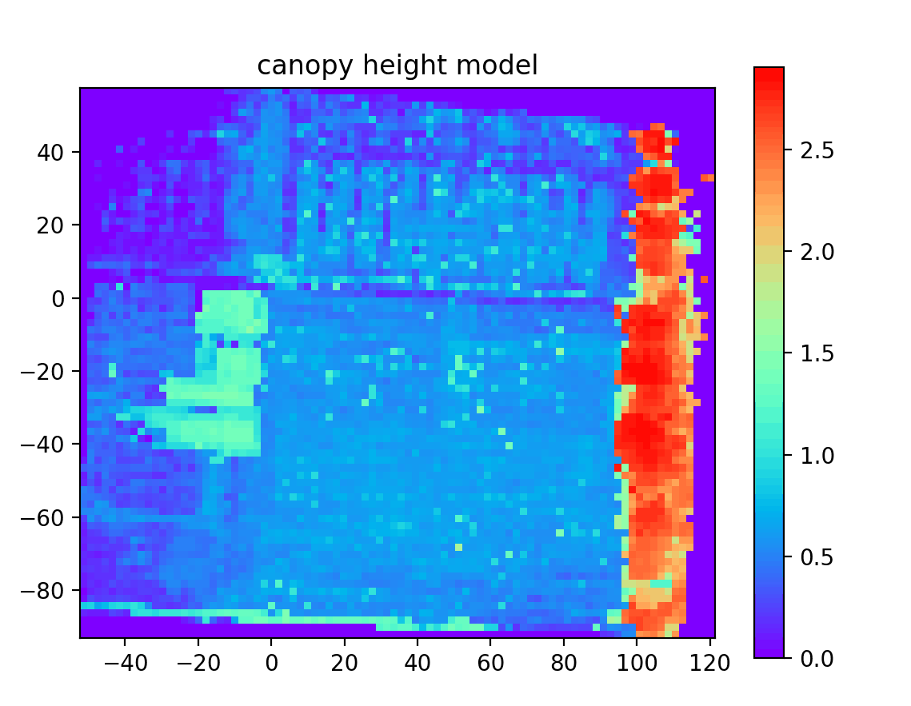

# PlantLidar : A Lidar package for Plant-Phenotype research


<div align="center">
  
  
</div>


## Installation
```
pip install PlantLidar
```

## To get pointcloud
if using a lidar, build a map from lidar scan through slam algorithm([FAST-LIO](https://github.com/hku-mars/FAST_LIO)) .   
using a camera can also get a pointcloud by inputing multiple view images to [colmap](https://github.com/colmap/colmap) .


## Quick Run
More details please check [PlantLidar-wiki](https://github.com/SkyCol/PlantLidar/wiki/PlantLidar-wiki)
### Compute height    
For tree:
```

```
For normal plant:
```

```

